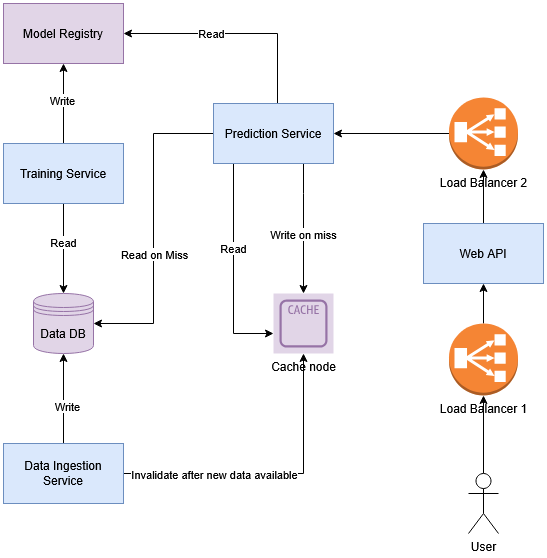

# stock-forecast

## Description
This project provides a backend API and an ML model for stock price forecasting trained on the historical 
performance of the S&P 500.

## Functional Requirements
1. Users should be able to send a ticker name to receive predictions of the closing price.

## Non-functional Requirements
1. The API should answer with the predictions in under 1 second for 95% of the requests.
2. The system should be able to handle 1,000 concurrent requests.

## Core Features
* Forecast: Provides a JSON array of the predicted closing prices for a valid ticker.
* One central ML model trained on the historical data of the S&P 500 companies.

## System Architecture
The system architecture is defined to be as follows. We have two distinct paths - one Online and one Offline Path.
The Online Path is supposed to answer a user's request for the next predictions in real-time, adhering to our NFRs.
The Offline Path on the other hand has two main distinctions:
1. It fetches the newest stock data right after closing to ensure the database is always populated with the most recent data.
2. It retrains the model on this data weekly to achieve models knowing the most recent data for accurate predictions.

As our storage, we have:
* The `Data DB` which holds all the historical stock prices and features which were engineered,
* The `Model Registry` which saves the trained model, and
* The `Cache` which allows for efficient retrieval of data for the predictions. This enables to achieve our NFR of answering
requests within 1 second.

Our services are:
* The `Web API` that serves as the main entrypoint for the users,
* The `Prediction Service` that predicts the closing prices for a specific stock to return to the API, 
* The `Training Service` whose purpose is to train the ML model on the available data and save it to the 
`Model Registry`, and
* The `Data Ingestion Service` who calls the external API to receive new data on the stock prices and saves 
them to our `Data DB`

